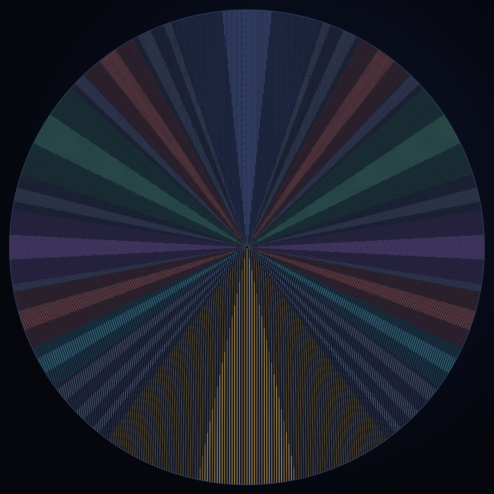
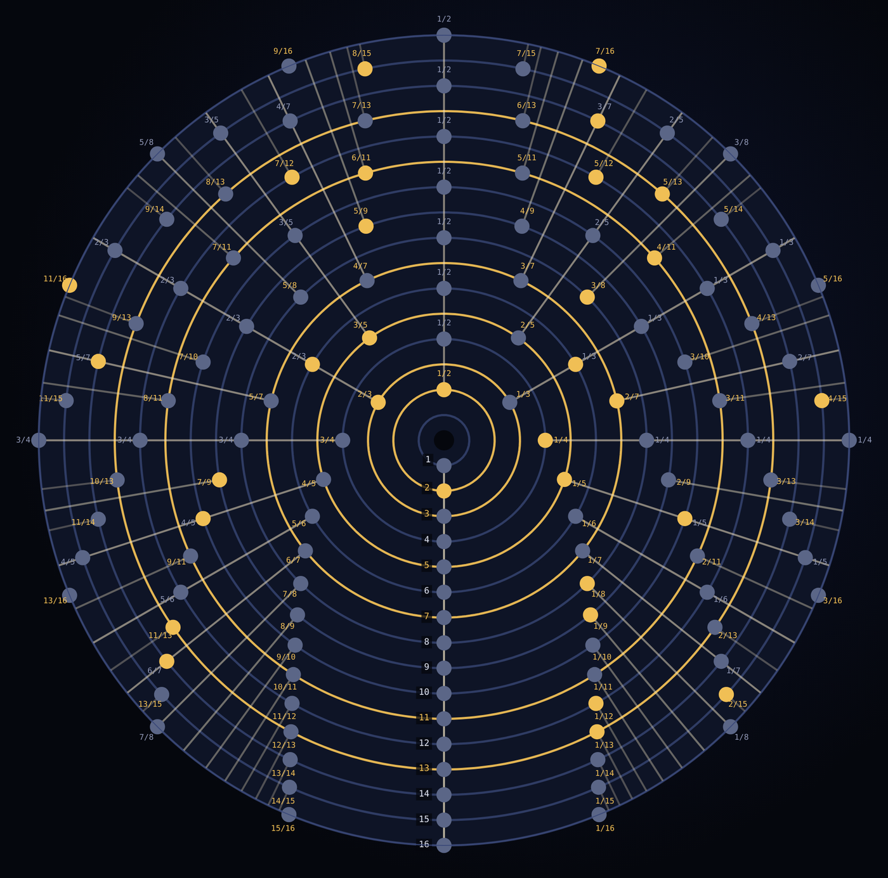

# Prime Tread Wheel

The counting numbers rolled onto a wheel that grows by one tick per layer, while the tick never changes size. From that one rule, ratio, divisibility, evenness and the Möbius balance show up as geometry you can see.



**Play with it:** https://ostoe.com/prime-tread-wheel/ (also on GitHub Pages: https://cosmolalia.github.io/prime-tread-wheel/)

Registered in the [OSTOE claims registry](https://ostoe.com/entries/prime-tread-wheel.html) as entry `prime-tread-wheel` (Established) + `gap-prime-between-triangulars` (Open gap).

## What's here

| File | What it is |
| --- | --- |
| [index.html](index.html) | The wheel. Roll it, look closer, color ticks by prime, visit, slip and more, or switch to the cylinder (drum) view. |
| [problem-wheels.html](problem-wheels.html) | Collatz, Riemann's zeros, Goldbach, twin primes and prime races, each on its own wheel. |
| [globe.html](globe.html) | The same counting wrapped onto a sphere, with the layer balance and the running Mertens balance. |
| [PAPER.md](PAPER.md) | A short paper. Every claim is tagged and sourced. |
| [probes/](probes/) | Python scripts. `verify.py` reproduces every number in the paper. |
| [images/](images/) | Figures. |

All three pages are single self-contained HTML files with no build step. To host them, turn on GitHub Pages for this repository (deploy from the main branch, root folder).

## The rule

Layer m holds the m numbers after the triangular number T(m−1), where T(m) = m(m+1)/2. Tick k of layer m sits k/m of the way around. Every layer is one tick longer than the layer inside it. Laid flat, the layers are the rows of Floyd's triangle.



## What it shows

| Claim | Status |
| --- | --- |
| Each spoke is a fraction a/b; its g-th visit holds g(gb² − b + 2a)/2, so every visit from the third on is composite | Proven; the divisibility is already known (see PAPER.md) |
| Each spoke carries at most two primes, and every layer m ≥ 3 has exactly φ(m) seats a prime can take | Proven; checked to layer 800 |
| Ticks slip by their fraction of the turn, so a/b lines up every b layers and the spokes are straight at every scale | Elementary |
| Evenness is pinned to the half-turn axis; the half-turn spoke holds 2, 8, 18, 32, 50 | Proven |
| The arrows at each layer's fresh ticks sum to μ(m); their running total is the Mertens function, tied to the Riemann Hypothesis | Classical |
| The first tick of each layer (the lazy caterer numbers) is about twice as prime-rich as chance | Known; checked to layer 100,000 |
| Does every layer hold a prime? | Open |

No result here is a new theorem. What's new is one rule that makes them all visible together, and tools to explore it. If you know where something here is already written down, or can take it further, open an issue.

## Run the checks

```
cd probes
python3 verify.py
```

Needs Python 3 and numpy and takes about ten seconds. The other probes are described in [probes/README.md](probes/README.md).

## License

Code: MIT (see [LICENSE](LICENSE)). Text and images: [CC BY 4.0](https://creativecommons.org/licenses/by/4.0/).

Made by Obi (Sylvan Gaskin), with Claude.
